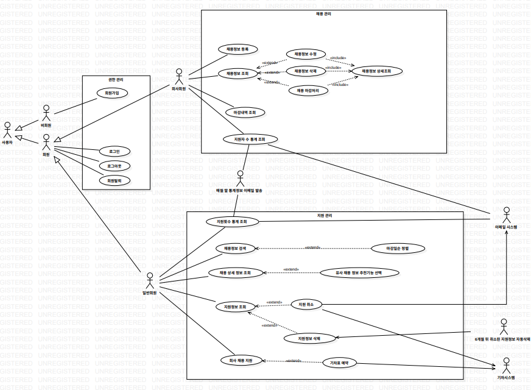
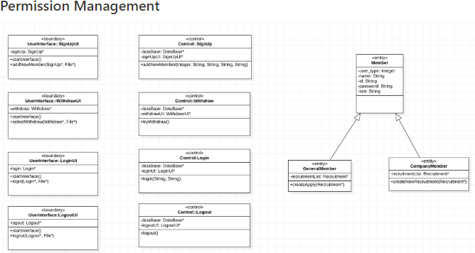
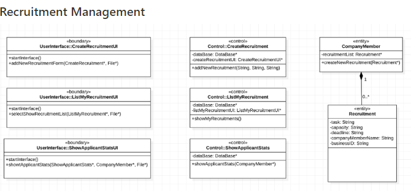
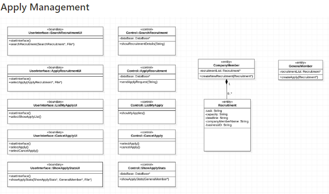

## Overview

* 이 프로젝트에서는 채용 정보 시스템을 개발한다.
* 이 시스템에서는 회사는 면접이 필요한 채용 정보를 등록해서 지원자를 모집할 수 있고 지원자는 회사에 지원하고 관련 서비스를 이용할 수 있다.

## People

* [YoungJeansKR](https://github.com/youngjeanskr "김영진")
* [Seung-Jie](https://github.com/Seung-Jie "백승진")
* [kim-wonjin](https://github.com/kim-wonjin "김원진")
* [ye0ngeun](https://github.com/ye0ngeun "이영은")

## Language / IDE

* 
* 
* 
* 
* 

## Functions

* 회원 가입 기능
  * 사용자는 사용 권한을 얻기 위해서 회원 가입을 해야 한다.
  * 회사 회원과 일반 회원으로 구분되며 자신의 기본 정보(회사 회원: 회사이름, 사업자번호, 사업분야, 주소, 전화번호 등, 일반 회원: 이름, 주민번호, 주소, 전화번호 등)와 ID/Password를 입력해야 한다.

 

* 회원 탈퇴 기능
  * 회원은 이 시스템에서 탈퇴할 수 있다.
  * 탈퇴와 동시에 시스템의 사용 권한은 소멸된다.
  * 회사 회원은 등록한 채용 정보가 하나도 없는 상태에서 탈퇴할 수 있다.

 

* 로그인/로그아웃 기능
  * 회원은 시스템 기능을 사용하기 위해서 등록한 ID와 password로 로그인해야 하며 로그아웃할 수 있다.

 

* 채용 정보 등록 및 조회/수정/삭제 기능
  * 회사 회원은 채용 정보를 등록할 수 있다.
  * 등록 시 직책, 업무, 인원 수, 신청 마감일 등의 정보를 입력해야 한다.
  * 회원 자신이 등록한 채용 정보 리스트를 조회할 수 있고 특정 채용 정보를 선택한 후에 원하는 항목을 수정하거나 해당 채용 정보를 삭제할 수 있다.

 

* 채용 마감 처리 및 마감 내역 조회 기능
  * 회사 회원은 자신이 등록한 채용 정보 중에서 원하는 지원자 수에 도달한 경우 채용을 조기 마감 처리할 수 있다.
  * 마감일이 지났거나 마감 처리된 채용 정보 내역을 조회할 수 있다.
  * 마감일의 오름차순으로 정렬해서 출력하며 각 채용 정보에 대해 직책, 업무, 신청 마감일 정보를 출력한다.

 

* 채용 정보 조회 및 지원 기능
  * 일반 회원이 회사이름 혹은 업무 중에 하나를 선택하여 검색할 수 있다.
  * 검색 결과로 채용 정보 리스트(회사이름, 마감일 정보)를 출력한다.
  * 현재 시점에서 마감일이 지나지 않은 정보만 출력한다.
  * 디폴트 정렬 기준은 회사이름의 오름차순이며 회원이 마감일로 변경할 수 있다.
  * 지원을 희망하는 채용 정보를 선택하면 해당 채용의 상세한 정보(회사이름, 직책, 업무, 인원수, 신청 마감일)가 출력되며 즉시 지원할 수 있다.

 

* 유사 채용 정보 추천 기능
  * 특정 채용 정보의 상세 화면에서 해당 채용 내용과 유사한 채용 정보를 추천하는 기능을 선택하여 실행할 수 있다.
  * 마감일까지 남은 시간이 짧은 채용 정보부터 정렬하여 출력한다.

 

* 기차 예약 연계 기능
  * 일반 회원이 특정 회사 채용에 지원을 완료 후에 원하는 경우 기차표 예약을 진행할 수 있으며 해당 기록은 기차 예약시스템으로부터 전달받아서 시스템 내에 유지한다.

 

* 지원 정보 조회 및 취소 기능
  * 일반 회원은 자신의 지원 정보(회사이름, 직책, 업무, 인원수, 신청 마감일)를 조회할 수 있다.
  * 회사이름의 오름차순으로 정렬해서 출력한다.
  * 마감일이 지나지 않은 지원 정보를 선택해서 지원을 취소할 수 있으며 취소된 채용 정보는 해당 회원의 이메일로 통보되며 연계된 기차 예매는 자동으로 취소 요청된다.

 

* 지원 정보 삭제 기능
  * 마감 시간이 지난 지원 정보는 임의로 삭제가 가능하며 취소된 지원 정보는 6개월이 지나면 자동으로 삭제된다.

 

* 지원 정보 통계 기능
  * 회사 회원이 현재까지 등록한 모든 채용 정보에 대해 신청 마감시간 기준으로 연도별, 직책별 및 업무별 지원자 수를 출력한다.
  * 일반 회원은 본인이 지원한 정보에 대해 마감시간 기준으로 월별, 직책별, 업무별 지원 횟수를 출력한다.
  * 매월 말일에 각 회원에게 해당 통계 정보를 이메일로 발송한다.

## Usecase Diagram

## Design Class Diagram

## Link

* [Notion](https://hill-crow-f2e.notion.site/2fbf94fe532e47ed8958407022f00082 "소프트웨어공학 팀프로젝트")
